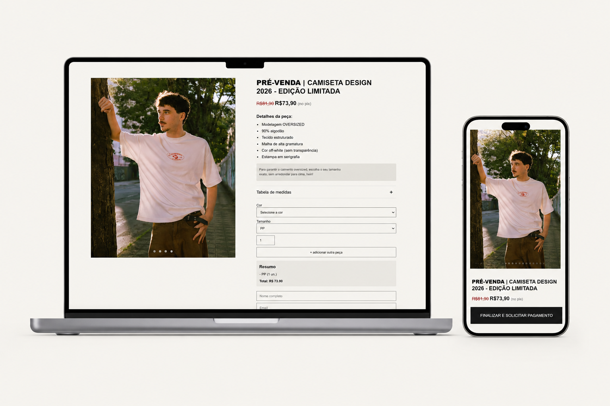

# CADuco — Pré-venda de Camiseta

## 🔗 Deploy

[https://caduco.vercel.app/](https://caduco.vercel.app/)

---

## Sobre o projeto

O **CADuco** é uma landing page de pré-venda desenvolvida para uma camiseta de edição limitada voltada ao curso de design FURB.

O projeto foi construído com foco em:

* experiência mobile-first
* estética editorial minimalista
* navegação fluida
* conversão simplificada
* integração com WhatsApp e Google Forms

A proposta foi criar uma experiência que se aproximasse visualmente de interfaces modernas de marcas e e-commerces de moda, mantendo a implementação totalmente em **HTML, CSS e JavaScript puro**, e ao mesmo tempo, coletando os dados de compra na planilha.

---

## Preview do projeto

> Interface desenvolvida com foco em experiência mobile e visual clean.

---

# Funcionalidades

## Sistema de pedido dinâmico

* seleção de cor
* seleção de tamanho
* controle de quantidade
* adição de múltiplas peças
* remoção dinâmica de itens
* resumo automático do pedido
* cálculo automático do valor total

---

## Experiência mobile-first

O layout foi pensado inicialmente para dispositivos móveis, priorizando:

* navegação vertical fluida
* botão de compra fixo na parte inferior
* comportamento semelhante a aplicativos modernos
* foco visual no produto
* redução de distrações

---

## Integração com WhatsApp

Ao finalizar o pedido:

* o resumo é gerado automaticamente
* o cliente é redirecionado para o WhatsApp
* a mensagem já é preenchida com os dados do pedido
* o processo reduz fricção na conversão

---

## Integração com Google Forms

Os dados do formulário também são enviados automaticamente para um Google Forms utilizando `fetch()`.

Isso permite:

* armazenamento dos pedidos
* organização dos clientes
* automação simples sem backend
* custo zero de infraestrutura

---

# Tecnologias utilizadas

* HTML5
* CSS3
* JavaScript
* Google Forms
* WhatsApp API
* Vercel

---

# Aprendizados

Durante o desenvolvimento deste projeto foram explorados conceitos como:

* eventos de toque (touch events)
* lógica dinâmica de carrinho
* responsividade avançada
* comportamento mobile
* integração sem backend
* UX para e-commerce
* organização de componentes visuais

---

# Conversão simplificada

Ao invés de utilizar um checkout tradicional, foi criada uma experiência mais direta:

1. usuário monta o pedido
2. resumo é gerado automaticamente
3. WhatsApp abre com mensagem pronta
4. pedido é salvo via Google Forms

Essa abordagem reduz complexidade técnica mantendo boa experiência de compra.

---

# Autora

**Beatriz Haiana Ferrari**

Designer & Front-end Developer

Projeto completo:

* Design gráfico (estampa da camiseta)
* Desenvolvimento front-end (site)
* Fotografia (ensaio de fotos da camiseta)

---

# Licença

Este projeto foi desenvolvido para fins de estudo, portfólio e experimentação de interface.
